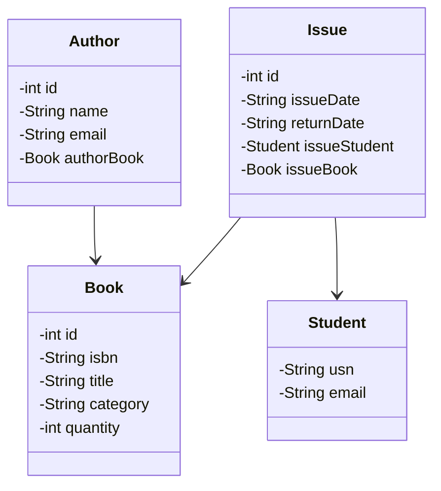

# HW | Java IronLibrary (Unit 3 homework)

<div align="center">
  <p>Made with 💙&nbsp;&nbsp;by</p>
  <a href="https://github.com/evagapi/homework-java-ironlibrary/graphs/contributors">
  
  </a>
</div>

## Features
Navigate through a text-based menu to:

- Add a new book to the library
- Search for a book by its title
- Search for a book by its category
- Search for a book by its author
- Display a table containing a list of all books along with their authors
- Issue a book to a student
- Display the information of the book issued to a student by their USN
- Exit Application

## Tech Stack

- [Spring Boot](https://spring.io/projects/spring-boot) – Framework
- [Hibernate](https://hibernate.org/) – ORM
- [MySQL](https://www.mysql.com/) – Database
- [Lombok](https://projectlombok.org/) - Reduces boilerplate code
- [H2 Database](https://www.h2database.com/) – Testing Database
- [jfiglet](https://github.com/lalyos/jfiglet) – Text Art Generator

## Getting Started

### Prerequisites

Here's what you need to be able to run IronLibrary:

- Java (version >= 21)
- MySQL Database
- Maven

### 1. Clone the repository

```shell
git clone https://github.com/evagapi/homework-java-ironlibrary.git
cd homework-java-ironlibrary
```

### 2. Install Maven dependencies

Using Command Line

```shell
mvn install
```
Using IntelliJ IDEA
- Open IntelliJ IDEA.
- Open the ironlibrary project.
- Navigate to View > Tool Windows > Maven.
- Click on Reload All Maven Projects icon to update dependencies.
- Alternatively, right-click on pom.xml and select Reload Project.

## Configure MySQL 

### Create your local profile resources file

You are provided with an example file named [application-local_example.properties](src%2Fmain%2Fresources%2Fapplication-local_example.properties). Rename it to `application-local.properties` and change the properties to match your configuration:

```
spring.datasource.url=jdbc:mysql://localhost:[yourlocalhostport]/[yourdatabasename]?serverTimezone=UTC
spring.datasource.username=[youruser]
spring.datasource.password=[yourpassword]
```

### First Run

The database will be automatically created the first time you run the application with the following configurations:

```shell
spring.profiles.active=local

spring.datasource.driver-class-name=com.mysql.cj.jdbc.Driver

spring.jpa.hibernate.ddl-auto=create

spring.jpa.show-sql=true
```
### After the First Run

After the first run, you need to update the `spring.jpa.hibernate.ddl-auto` to `update` to prevent data overwriting. 
You can update `spring.jpa.show-sql` to `false` to disable SQL logging.

## Documentation

### UML Diagramm

